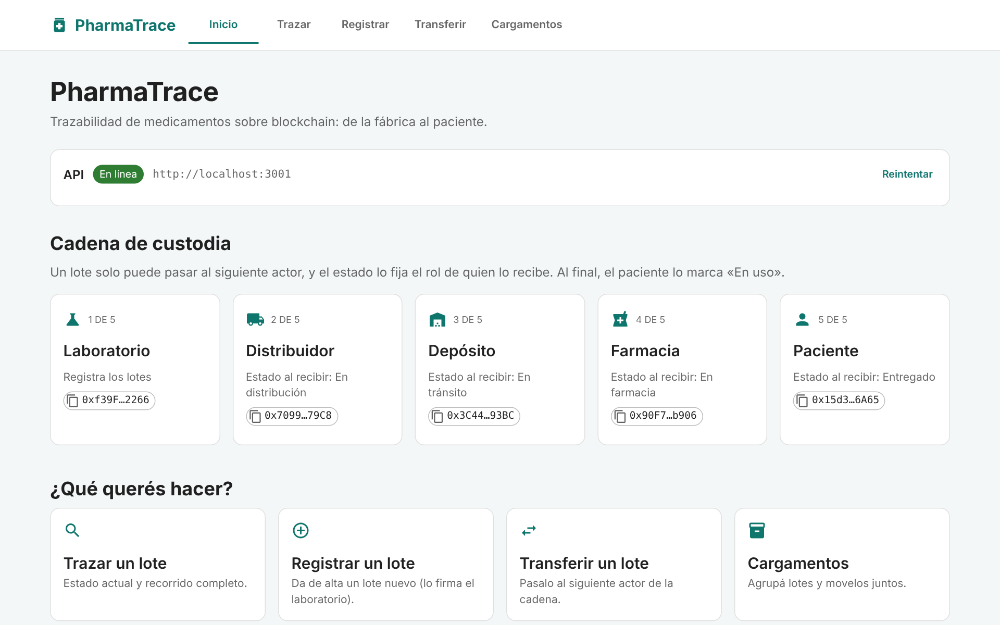
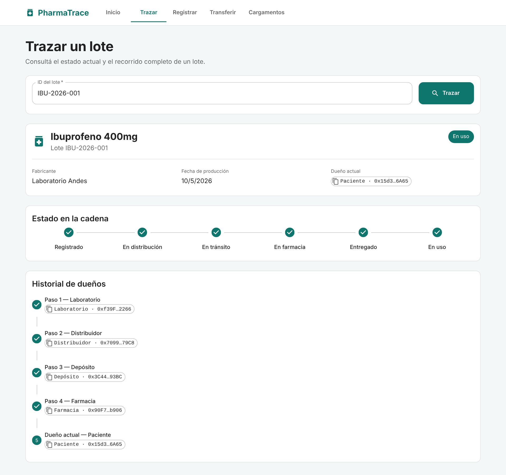
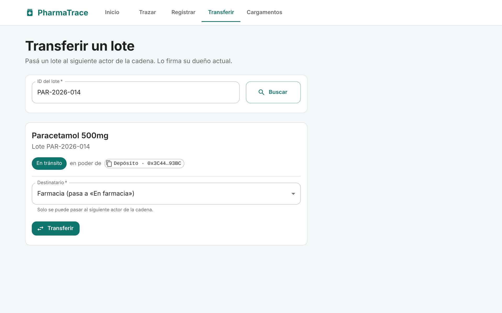
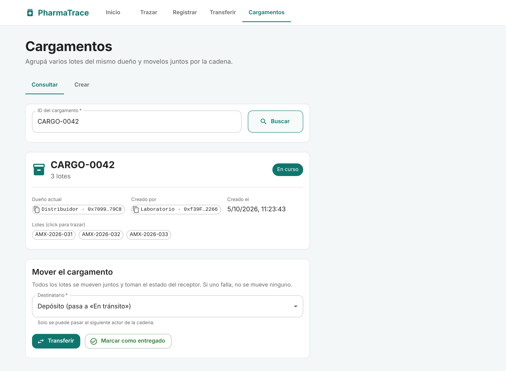
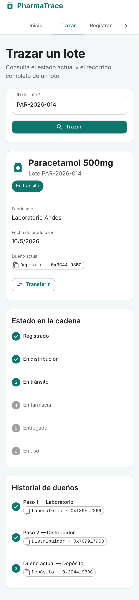

# PharmaTrace UI

Interfaz web de [PharmaTrace](https://github.com/gastonhp1/PharmaTrace) (React + Vite + MUI). Habla
únicamente con la API REST del backend; no se conecta a la blockchain ni a ninguna wallet: las
operaciones las firma el backend con la clave del dueño actual de cada lote o cargamento.



## Capturas

Trazabilidad de un lote que recorrió toda la cadena hasta quedar «En uso»:



Transferir un lote: se elige el destinatario y el estado se deriva solo (solo está habilitado el siguiente actor de la cadena):



Cargamentos: los lotes se mueven juntos y toman el estado del receptor:



En el celular (sin scroll horizontal):



> Las capturas se sacaron contra el backend real, en local, con datos de demo.

## Pantallas

| Ruta | Qué hace | Endpoint |
| --- | --- | --- |
| `/` | Estado de la API y cadena de actores | `GET /` |
| `/trace/:batchId?` | Estado, dueño e historial de un lote. Desde acá se marca «en uso» | `GET /api/drug/:id`, `POST /api/mark-in-use` |
| `/register` | Registrar un lote | `POST /api/register` |
| `/transfer?batch=ID` | Transferir un lote al siguiente actor | `POST /api/transfer` |
| `/cargo` | Consultar, crear, transferir y entregar cargamentos | `GET /api/cargo/:id`, `POST /api/cargo/{create,transfer,deliver}` |

## Cómo corre

```bash
npm install
cp .env.example .env     # y ajustá VITE_API_URL si el backend no está en :3001
npm run dev              # http://localhost:5173
```

Con el backend y la red local levantados (ver el README del backend: `npx hardhat node`,
`npm run deploy:all`, `cd backend && npm start`).

### Variables (`.env`)

| Variable | Para qué |
| --- | --- |
| `VITE_API_URL` | URL de la **API** (por defecto `http://localhost:3001`). No es el nodo de Hardhat (`:8545`). |
| `VITE_API_KEY` | Se manda como `x-api-key`. El backend la exige en todas las escrituras (valor de `API_KEY` en `backend/.env`, que genera `npm run deploy:all`), salvo que corra con `AUTH_DISABLED=true`. Todo `VITE_*` queda visible en el bundle: solo para desarrollo local. |

### Direcciones de los actores

Salen de `src/config/actor-info.js`. `npm run deploy:all` del backend lo pisa solo si este repo está
clonado **al lado** como `../PharmaTrace-UI`; si no, editalo a mano con las direcciones de las
cuentas cuyas claves están en `backend/.env`. (El deploy también escribe `src/abi/` y
`src/config/contract-address.js`: este UI no los usa.)

## Reglas que el UI respeta

El contrato (`DrugTracker.sol`) solo deja pasar un lote al **siguiente** actor, y el estado lo fija el
rol del receptor. Por eso en Transferir y Cargamentos no se elige el estado: se elige el
destinatario y el estado se deriva.

| Destinatario | Estado resultante |
| --- | --- |
| Distribuidor | En distribución |
| Depósito | En tránsito |
| Farmacia | En farmacia |
| Paciente | Entregado |

«En uso» no sale de una transferencia: lo marca el paciente (`/api/mark-in-use`). Un lote dentro de
un cargamento no se transfiere suelto, y un cargamento entregado ya no se puede mover.

## Estructura

```
src/
├── api.js              Cliente de la API: errores como excepciones, mensajes en español, x-api-key opcional
├── domain.js           Cadena de actores y estados (espejo de los enums del contrato)
├── hooks/useAction.js  { loading, error, data } para cada llamada
├── components/         Layout, AddressChip, StateStepper, RecipientSelect, ...
└── pages/              Dashboard, Trace, Register, Transfer, Cargo
```

## Scripts

`npm run dev` · `npm run build` · `npm run preview` · `npm run lint`
